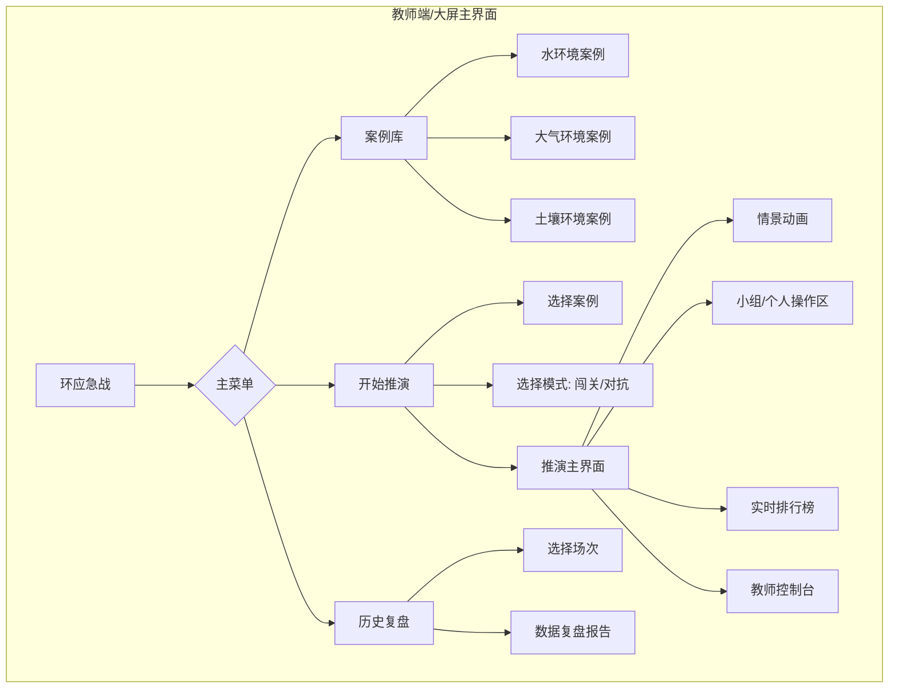
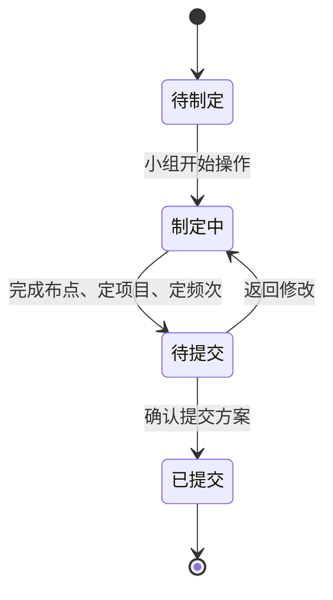

# 产品需求文档 (PRD) - "环应急战"教学平台

## 1. 文档信息

| 版本  | 日期       | 作者     | 修订说明                               |
| :---- | :--------- | :------- | :------------------------------------- |
| V1.0  | 2025-05-24 | 1.产品经理 | 初稿，根据用户（协调者）输入创建 |

### 1.2 文档目的

本 文档旨在详细说明“环应急战”应急监测情景推演教学平台（以下简称“本产品”）的功能需求、非功能需求及相关设计指导。其核心目标是为设计、开发、测试及运营团队提供清晰、统一的产品定义和执行依据，确保产品能有效解决《应急监测》课程中学生对流程理解不深、缺乏沉浸感和难以模拟决策的核心痛点。

### 1.3 相关文档引用

| 文档名称                               | 路径/来源                                  |
| :------------------------------------- | :----------------------------------------- |
| 2024年授课计划（应急监测28课时）       | 用户上传文件 [cite: 1, 2, 3, 4]                  |
| 突发环境事件应急监测技术规范 (HJ 589-2021) | 用户上传文件 [cite: 5, 6, 7, 8, 9, 10, 11, 12, 13] |
| 国家突发环境事件应急预案                 | 用户上传文件 [cite: 14, 15, 16, 17, 18, 19, 20] |
| 重特大突发水环境应急监测工作规程         | 用户上传文件 [cite: 21]                        |
| 突发环境事件分级标准                     | 用户上传文件 [cite: 22, 23, 24]                  |
| 产品路线图 (Roadmap)                   | `docs/Roadmap.md`                          |
| 用户故事地图 (User Story Map)          | `docs/User_Story_Map.md`                   |
| 产品评估指标框架 (Metrics Framework)   | `docs/Metrics_Framework.md`                |

## 2. 产品概述

### 2.1 产品名称与定位

* **产品名称**: “环应急战” - 应急监测情景推演教学平台
* **产品定位**: 一款专为高等职业教育《应急监测》课程设计的，基于真实案例和国家规范的课堂互动式情景模拟教学软件。

### 2.2 产品愿景与使命

* **愿景**: 成为环境监测职业教育领域的标杆性教学工具，引领情景化、互动式教学新模式。
* **使命**: 通过高度仿真的情景推演和游戏化互动，将抽象的应急监测知识转化为学生可深度理解、记忆和应用的实践技能，培养具备实战决策能力的下一代环保专才。

### 2.3 价值主张与独特卖点 (USP)

* **价值主张**:
    * **对教师**: 提供一个将枯燥法规和复杂流程转化为生动课堂互动的教学工具，通过预设案例和游戏化机制，极大降低备课难度，提升教学效果和课堂吸引力。
    * **对学生**: 提供一个在“做”中学、在“玩”中学的沉浸式学习环境，通过模拟真实决策和团队协作，深刻理解应急监测的核心要义。
* **独特卖点 (USP)**:
    * **权威内核**: 深度融合国家应急预案 [cite: 14] 与技术规范 [cite: 5]，确保教学内容的专业性与权威性。
    * **课堂中心化互动**: 专为大屏演示设计，支持实时的小组对抗和排名激励，将课堂变为“应急指挥中心”。
    * **决策模拟**: 核心玩法围绕应急监测中的关键决策点（如布点、定项目、定频次） [cite: 4, 9, 21] 展开，让学生在模拟中学习和承担决策后果。

### 2.4 目标平台列表

* **Web (教师端/大屏主界面)**: 教师通过浏览器在教学一体机或连接投影仪的电脑上操作，作为课堂演示的主界面。界面设计需适配主流大屏分辨率（如1920x1080）。

### 2.5 产品核心假设

1.  **教学有效性假设**: 游戏化、情景化的推演能显著提升学生对复杂应急流程的理解和记忆效果，优于传统PPT教学。
2.  **课堂适用性假设**: 产品的互动节奏和时长能够匹配一堂课（45-90分钟）的教学安排。
3.  **用户接受度假设**: 教师愿意使用新的教学软件进行授课；学生对小组对抗、实时排名的形式抱有高昂的参与热情。

### 2.6 商业模式概述

* 初期为特定院校（长沙环境保护职业技术学院）定制开发的教学工具，不涉及商业收费。
* 未来可拓展为SaaS产品，向全国其他设有环境监测专业的高等职业院校提供标准化或定制化的教学解决方案。

## 3. 用户研究

### 3.1 目标用户画像 (详细)

#### 3.1.1 教师 (赵根成、黄楠等)

* **人口统计特征**: 长沙环境保护职业技术学院资深教师，拥有丰富的环境监测专业知识和教学经验。
* **行为习惯与偏好**: 熟悉传统教学模式，但乐于接受能提升教学质量的创新工具。重视教学内容的准确性、权威性，要求软件操作稳定、简洁、易于课堂管理。
* **核心需求与痛点**:
    * **需求**: 需要生动化、具象化地讲授《应急监测》课程中的复杂流程 [cite: 13, 21]。
    * **需求**: 希望有一种方式能让学生主动参与、深度思考，而非被动听讲。
    * **痛点**: 难以将枯燥的法规文件（如HJ 589 [cite: 5]）转化为学生感兴趣的教学内容。
    * **痛点**: 无法在课堂上有效模拟应急决策过程及其带来的后果，教学缺乏实践感。
* **动机与目标**: 提升教学效率和效果，激发学生学习兴趣，培养符合行业真实需求的专业人才。

#### 3.1.2 学生 (监测22301-22310、力合22301班)

* **人口统计特征**: 环境监测技术专业的在校大学生，数字时代原住民，对互动、游戏化元素接受度高。
* **行为习惯与偏好**: 习惯使用各类软件和App，偏好视觉化、即时反馈和带有竞技性的学习方式。
* **核心需求与痛点**:
    * **需求**: 希望课程内容有趣、易懂，能与未来工作场景联系起来。
    * **需求**: 渴望实践操作，而不仅仅是记忆理论知识。
    * **痛点**: 理论课程（如法规解读）乏味，容易走神，学习效率低。
    * **痛点**: 对复杂的流程和规范感到抽象，难以建立完整的知识体系。
* **动机与目标**: 在轻松有趣的氛围中掌握课程核心知识，提升实践技能，为未来就业增加竞争力。

### 3.2 用户场景分析

#### 3.2.1 核心使用场景详述

**场景名称**: 一堂基于“环应急战”的《水环境应急监测》案例推演课
* **时间**: 某周二上午，第3-4节课（90分钟）
* **地点**: 长沙环保学院多媒体教室
* **人物**: 赵老师，监测22301班全体学生
* **事件**: 课程进行到授课计划中的“项目二 突发水环境事件应急监测” [cite: 2, 3]。
* **流程**:
    1.  **课前准备 (5分钟)**: 赵老师登录“环应急战”平台，选择“湘江某河段化工厂苯胺泄漏”案例，设定模式为“小组对抗”。
    2.  **分组与动员 (5分钟)**: 学生按座位自然分成6个小组，扫描屏幕上的二维码加入各自队伍，并为队伍命名。赵老师讲解本次推演的目标和规则。
    3.  **情景导入 (5分钟)**: 大屏幕播放案例动画：一艘货船撞击化工厂码头，导致苯胺储罐破裂泄漏，污染物流入湘江，威胁下游15公里处的饮用水源地。
    4.  **推演阶段一: 初步判别 (10分钟)**: 各小组根据屏幕上显示的有限信息（“现场有苦杏仁味”、“水面有油状漂浮物”）和《突发环境事件应急监测现场调查信息表》 [cite: 12] 的提示，通过多选题和关键词拖拽，完成对“特征污染物”的初步判断。排行榜实时显示各组的得分和用时。
    5.  **推演阶段二: 制定方案 (20分钟)**:
        * **决策核心**: 各小组进入“应急监测方案”制定界面，需要在地图上拖拽图标完成监测点位布设（需考虑对照、控制、削减断面 [cite: 9]）。
        * 同时，需选择监测项目（苯胺、pH、DO等）和监测频次。
        * 赵老师在教师控制台上观察各组方案，对共性问题进行提醒和引导。
    6.  **推演阶段三: 跟踪监测 (20分钟)**: 方案提交后，系统开始模拟时间流逝和污染团扩散。大屏幕上以动态曲线图展示各组“监测”到的数据。各组需根据数据变化趋势，判断污染团位置，并回答系统弹出的关于应急处置效果的问题。
    7.  **推演阶段四: 终止决策 (5分钟)**: 当数据显示污染物浓度已连续48小时达标时 [cite: 10]，系统提示可以考虑终止响应。各小组需做出“终止”或“继续监测”的决策。
    8.  **复盘与总结 (20分钟)**: 推演结束。平台自动生成最终排名和各小组的“决策复盘报告”。赵老师调出2-3个小组的监测方案进行对比讲解，点明优劣，并结合《规范》 [cite: 5] 总结本堂课的核心知识点。

#### 3.2.2 边缘使用场景考量

* **教师备课**: 教师在课前登录平台，熟悉案例库中的不同案例，预演流程，以便在课堂上更好地引导学生。
* **演示模式**: 在没有学生参与的情况下，教师可以使用“演示模式”，单人按预设的最优路径完整地走完一个案例流程，用于纯粹的知识点讲解。

## 4. 市场与竞品分析

### 4.1 市场规模与增长预测

* **目标市场**: 全国开设环境工程、环境监测、应急管理等专业的普通高等院校及职业院校。
* **市场潜力**: 随着国家对应急管理人才培养的重视，以及教育信息化“金课”、“智慧课堂”建设的推进，专业化的虚拟仿真教学软件需求日益增长。本产品作为细分领域的先行者，具备良好的市场前景。

### 4.2 行业趋势分析

* **技术驱动**: 虚拟仿真、大数据、AI技术正逐步渗透教育领域，推动教学模式从知识传授向能力培养转变。
* **教学理念**: 游戏化学习（GBL）、项目式学习（PBL）等先进教学理念受到普遍认可，强调学生的主动性和参与感。
* **政策导向**: 国家政策鼓励产教融合、校企合作，开发具有行业特色的数字化教学资源。

### 4.3 竞争格局分析

* **直接竞争对手**: 目前市场上缺乏专门针对“环境应急监测”这一细分领域的课堂互动教学软件。
* **间接竞争对手**:
    * **通用虚拟仿真实验平台**: 提供标准化的化学、物理实验模块，但缺乏与真实应急案例和复杂决策流程的结合。
    * **线下沙盘/桌面推演**: 互动性强，但组织成本高、准备复杂、过程和结果难以量化评估和复用。
    * **传统PPT/视频教学**: 灵活性高、成本低，但互动性、沉浸感和决策训练效果极差，是本产品旨在取代的主要方式。

### 4.4 竞品功能对比矩阵

| 特性/产品         | **环应急战 (本产品)** | 通用虚拟仿真平台 | 线下沙盘推演 | 传统PPT/视频 |
| :---------------- | :-------------------- | :------------- | :--------- | :----------- |
| **专业性(环境应急)** | **高，深度定制** | 低             | 中         | 低           |
| **课堂互动性** | **高 (小组对抗/实时排名)** | 低             | 高         | 极低         |
| **决策模拟** | **核心功能** | 弱             | 强         | 无           |
| **游戏化机制** | **内置** | 无             | 弱         | 无           |
| **数据化复盘** | **自动化，可追溯** | 有限           | 无         | 无           |
| **部署/使用成本** | 中                    | 高             | 高         | 低           |

### 4.5 市场差异化策略

* **聚焦细分，做深做透**: 紧密围绕《应急监测》课程的教学大纲 [cite: 1] 和国家标准 [cite: 5, 14, 21]，构筑内容的专业壁垒。
* **强化互动，为课堂而生**: 一切功能设计以服务于大屏教学和课堂互动为首要原则，打造热烈的“战场”氛围。
* **突出决策，培养思维**: 将软件核心从“知识展示”转变为“决策训练”，让学生在选择与后果中学习，培养高阶思维能力。

## 5. 产品功能需求

### 5.1 功能架构与模块划分



### 5.2 核心功能详述

#### 5.2.1 [功能模块1] 案例推演引擎

* **功能描述 (用户故事格式)**:
    * 作为 **教师**, 我想要 **发起一场基于特定案例（如水体有机物污染）的推演**，并 **引导学生分组完成从事件响应到终止的全流程任务**，以便 **让他们在模拟实战中掌握应急监测的核心流程与决策要点**。
    * 作为 **学生**, 我想要 **以小组形式参与应急推演挑战**，通过 **在关键节点做出决策（如判断污染物、布设监测点）来获得分数**，以便 **在与同学的竞争中赢得胜利并学会专业知识**。
* **用户价值**: 将抽象的法规流程 [cite: 13, 21] 转化为具体的、可参与、有反馈的互动任务，有效解决三大教学痛点。
* **功能逻辑与规则**:
    1.  **推演启动**:
        * 教师从案例库选择案例，选择“小组对抗”模式。
        * 屏幕中央生成一个唯一的二维码/加入码，学生通过移动设备（无需App，Web页面即可）扫码，输入姓名并选择队伍后即可加入。
        * 所有小组准备就绪后，教师点击“开始推演”。
    2.  **推演阶段化**: 推演严格按照应急监测流程进行，分为四个计分阶段。
        * **阶段一: 污染态势初步判别**
            * **界面**: 播放事件动画，随后呈现图文并茂的现场信息。
            * **交互**:
                * **特征污染物判断**: 以多选题形式呈现（如A. 苯胺 B. 氰化物 C. 汞），正确答案唯一或多个。
                * **信息收集**: 提供虚拟的《现场调查信息表》 [cite: 12]，要求学生根据线索拖拽正确的关键词填入。
            * **计分**: 根据答案的 **准确度** 和 **提交用时** 计分。
        * **阶段二: 制定应急监测方案**
            * **界面**: 左侧为包含河流、污染源、敏感点（如饮用水水源地 [cite: 22]）的GIS风格地图；右侧为监测项目和频次选择区。
            * **交互**:
                * **布点**: 从图标栏拖拽“对照断面”、“控制断面”、“削减断面”等图标至地图的合适位置。系统会根据与最优解的距离、是否覆盖关键区域等进行评分。
                * **定项目/频次**: 以勾选列表形式选择监测项目和采样频次。
            * **计分**: 综合评估方案的 **科学性** (是否符合规范 [cite: 9, 21])、**全面性** (是否覆盖所有关键点和项目)、**经济性** (是否过度监测)。
        * **阶段三: 跟踪监测**
            * **界面**: 地图上模拟污染团向下游移动。屏幕主区域以动态折线图展示关键断面的污染物浓度变化。
            * **交互**: 系统会在特定时间点（如污染团到达水源地前）弹出问题，如“根据当前数据，预测1小时后污染团前锋将到达何处？”，以选择题形式作答。
            * **计分**: 根据预测和判断的准确性计分。
        * **阶段四: 应急监测终止**
            * **界面**: 当监测数据满足终止条件时 [cite: 10]，系统会高亮显示“请求终止响应”按钮。
            * **交互**: 小组需在规定时间内做出决策。
            * **计分**: 决策 **时机** 是唯一评分标准。过早（数据未完全稳定达标）或过晚（造成资源浪费）都会扣分。
* **交互要求**:
    * 界面设计现代、简洁，突出核心信息。
    * 所有拖拽、点击操作响应流畅，有声音和视觉反馈。
    * 排行榜和分数变化需有动画效果，增强竞技感。
* **数据需求**:
    * 内置案例数据（地图、污染源信息、污染物扩散模型参数）。
    * 内置评分规则和最优解数据。
* **技术依赖**: 无。
* **验收标准**:
    * 教师能成功创建并主持一场小组对抗推演。
    * 学生能顺利加入并完成所有阶段的交互任务。
    * 系统的计分和排名功能准确、实时。
    * 推演流程中的所有决策点和知识点均能在提供的法规文件 [cite: 5, 14, 21] 中找到依据。

#### 5.2.2 [功能模块2] 数据复盘中心

* **功能描述 (用户故事格式)**: 作为 **教师**, 我想要在 **推演结束后，一键生成并展示所有小组的详细复盘报告**，特别是 **并排对比他们在关键决策（如布点方案）上的差异**，以便 **进行有针对性的分析和点评，巩固教学效果**。
* **用户价值**: 将游戏过程转化为有价值的教学资料，实现从“玩”到“学”的闭环。
* **功能逻辑与规则**:
    1.  **报告生成**: 推演结束后，系统自动汇总所有过程数据，生成复盘报告。
    2.  **报告内容**:
        * **最终排名与总分**: 展示各小组的最终成绩。
        * **分阶段得分详情**: 以雷达图或柱状图展示各组在四个阶段的得分情况。
        * **关键决策对比 (核心)**:
            * **方案对比**: 可选择任意2-4个小组，将其“应急监测方案”并排显示在屏幕上，方便教师对比讲解。
            * **路径回放**: 以时间轴形式回放某个小组的关键决策点和得分/失分事件。
        * **知识点关联**: 报告中涉及的失分点，会链接到内置的“理论知识库”，点击即可查看相关的法规条文或知识解释。
* **验收标准**:
    * 能够生成包含上述所有内容的复盘报告。
    * 决策对比功能清晰、直观。
    * 知识点链接准确无误。

### 5.3 次要功能描述

* **理论知识库**: 一个简单的内置静态页面模块，包含核心法规（HJ 589、国家应急预案等）的关键章节、术语解释、设备图鉴等，供学生在推演中随时查阅，也供复盘时链接跳转。

### 5.4 未来功能储备 (Backlog)

* **案例编辑器**: 允许教师自定义或修改案例，上传自己的地图、设定污染源和扩散参数。
* **移动端学生互操作**: 学生可通过手机进行更复杂的操作，如具体的仪器参数设置。
* **跨班级联赛**: 组织不同班级进行异步或同步的比赛。
* **AI助教**: 在推演中根据学生表现，由AI提供智能提示或引导。

## 6. 用户流程与交互设计指导

### 6.1 核心用户旅程地图

```mermaid
journey
    title 教师与学生的核心交互旅程
    section 教师: 课前准备
      备课: 2: 登录平台, 熟悉案例库
    section 教师: 课堂授课
      发起推演: 5: 选择案例与模式
      组织学生: 5: 展示加入码, 宣布规则
      主持推演: 5: 观察各组表现, 适时引导
      复盘总结: 5: 展示复盘报告, 对比讲解
    section 学生: 参与课堂
      加入推演: 5: 扫码入队
      协作决策: 5: 与组员讨论, 完成各阶段任务
      查看排名: 5: 关注实时排行榜, 感受竞争
      参与复盘: 5: 听老师讲解, 理解得失
```

### 6.2 关键流程详述与状态转换图 (制定监测方案)



### 6.3 对设计师 (UI/UX Agent) 的界面原型参考说明和要求

* **整体风格**: 科技感、专业、简洁。主色调可采用蓝色或绿色，辅以橙色或红色作为警示和高亮色。
* **大屏主界面布局**:
    * **顶部**: 显示案例名称、当前阶段、倒计时。
    * **左侧**: 交互操作区或信息展示区（如地图、数据图表）。
    * **右侧**: 实时排行榜，始终保持可见，包含小组名称、得分、排名变化。
    * **底部**: 教师控制台入口/当前任务提示。
* **地图界面**: GIS风格，清晰标注河流、道路、功能区、敏感点等。交互图标应明确易懂。
* **数据图表**: 清晰、易读，动态变化要流畅。关键数据点（如超标线）需高亮显示。

## 7. 非功能需求

### 7.1 性能需求

* **响应时间**: 所有用户点击操作的界面响应时间应小于0.5秒。
* **并发量**: 系统需支持至少10个小组（约50-60名学生）同时在线进行推演，数据交互无延迟。
* **稳定性**: 在一堂90分钟的课程中，系统需保证持续稳定运行，不能出现卡顿、掉线或崩溃。

### 7.2 安全需求

* **数据安全**: 学生的姓名等信息仅用于当次课堂，不应在服务器端做持久化存储或用于其他目的。
* **访问控制**: 只有教师账号才能创建和管理推演。

### 7.3 可用性与可访问性标准

* **易用性**: 教师经过简单培训（或阅读一份说明文档）后，应能独立完成所有操作。学生端交互应极为简单，符合扫码即用的直觉。
* **可访问性**: 界面色彩对比度应考虑投影仪的显示效果，字体大小应保证教室后排学生也能看清。

### 7.4 合规性要求

* 所有案例内容、流程、规范、术语必须严格遵守《中华人民共和国环境保护法》及本项目引用的各项国家标准和规范。

### 7.5 数据统计与分析需求

* 后台需记录每场推演的核心数据，用于产品迭代分析（详见`Metrics_Framework.md`）。
* 需要埋点的关键事件：教师创建推演、学生加入、各阶段任务提交、最终得分。

## 8. 技术架构考量

### 8.1 技术栈建议

* **前端**: 采用成熟的Web前端框架，如Vue.js或React，便于构建高度动态和交互的界面。
* **后端**: 采用Node.js或Java等，需要支持WebSocket等实时通信技术，以实现大屏与学生端、排行榜的实时数据同步。
* **数据库**: 可使用MySQL或PostgreSQL。

### 8.2 系统集成需求

* 暂无。未来可能需要与学校的统一身份认证系统或教务系统集成。

## 9. 验收标准汇总

### 9.1 功能验收标准矩阵

| 模块         | 功能点                 | 验收标准                                                                   | 优先级 |
| :----------- | :--------------------- | :------------------------------------------------------------------------- | :----- |
| **案例推演** | 创建/加入推演          | 教师能成功创建，学生能通过扫码顺利加入                                       | P0     |
|              | 阶段一：初步判别       | 能正确完成答题交互，系统能准确计分                                           | P0     |
|              | 阶段二：制定监测方案   | 能在地图上完成布点，能选择项目和频次，系统能根据规则评分                     | P0     |
|              | 阶段三：跟踪监测       | 能看到动态数据图表，能完成判断题交互                                         | P0     |
|              | 阶段四：终止决策       | 能在规定时机做出决策，系统能根据决策时机评分                                 | P0     |
|              | 实时排行榜             | 能够实时、准确地反映各组得分和排名                                           | P0     |
| **数据复盘** | 生成复盘报告           | 推演结束后能自动生成报告，内容完整准确                                       | P1     |
|              | 关键决策对比           | 能够支持并排对比多个小组的决策方案                                           | P1     |
| **理论知识库** | 内容查阅               | 能在推演中或复盘报告中链接到正确的知识点页面                                 | P2     |

## 10. 产品成功指标

* 详见 `docs/Metrics_Framework.md`。核心指标包括：**产品使用率（教师开课频率）、用户参与度（学生参与推演的比例）、教学有效性（通过前后测对比，检验学生知识掌握度的提升）**。